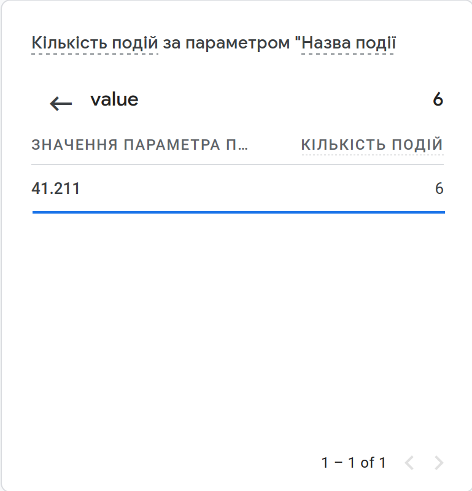

# Monitoring systems for user metrics 

This repository contains an implementation of a backend worker that retrieves the current UAH/USD exchange rate from NBU API and publishes it to Google Analytics 4.

##  Experiments and results

A Google Analytics account was set up to receive custom events from the backend worker.
### Realtime events

|||
|:-:|:-:|

### Events section

